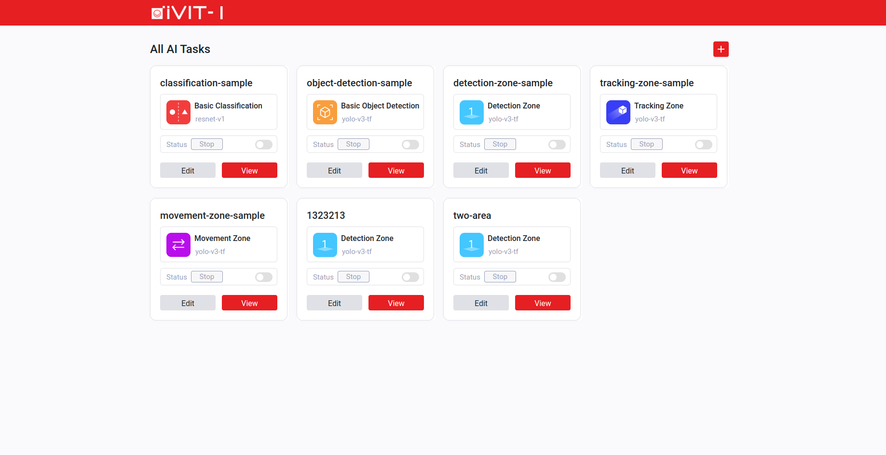

# iVIT-I-WebAPI-Fast
the faster web api for `iVIT-I`

# iVIT-I
iVIT (Vision Intelligence Toolkit) is an AI suite software. You can use iVIT-T to train a custom AI model and deploy it to `iVIT-I`. It provides a more straightforward usage and integrates with iCAP, `iVIT-I` is easy to integrate with your program using our `Web API (ivit-i-web-api-fast)` or `Python Library (ivit-i-{platform})`. 

| PLATFORM        | REPOSITORY
| ---             | ---
| Intel           | [ivit-i-intel](https://github.com/InnoIPA/ivit-i-intel)
| Xilinx          | [ivit-i-xilinx](https://github.com/InnoIPA/ivit-i-xilinx)
| Hailo           | [ivit-i-hailo](https://github.com/InnoIPA/ivit-i-hailo)
| NVIDIA dGPU     | [ivit-i-nvidia](https://github.com/InnoIPA/ivit-i-nvidia)
| NVIDIA Jetson   | [ivit-i-jetson](https://github.com/InnoIPA/ivit-i-jetson)

# Outline
- [iVIT-I-WebAPI-Fast](#ivit-i-webapi-fast)
- [iVIT-I](#ivit-i)
- [Outline](#outline)
- [Hardware Recommendations](#hardware-recommendations)
- [Pre-requirements](#pre-requirements)
- [Quick Start](#quick-start)
  - [Prepare Repository](#prepare-repository)
  - [Run `service` quickly with platform.](#run-service-quickly-with-platform)
  - [Visit Web Site](#visit-web-site)
- [Install Service](#install-service)
- [Configuration](#configuration)
- [About Running Scripts](#about-running-scripts)
- [Web API Documentation](#web-api-documentation)
- [Build Web Site for ARM](#build-web-site-for-arm)
- [Other Docs](#other-docs)
  - [Trouble Shooting](#trouble-shooting)
  - [Release Note](#release-note)
  - [Todo List](#todo-list)
- [Reference](#reference)

# Hardware Recommendations
The specification below shows the recommended requirements. In case of the use of another hardware, the correct functionality can not be guaranteed:
* `Intel`
  | Item    | Detail
  | ---     | ---
  | CPU     | Intel® 12th Gen Core™i7/i5 processors
  | Memory  | 16GB
  | Storage | 500GB
  | OS    | Ubuntu 20.04.4
* `NVIDIA`
  | Item    | Detail
  | ---     | ---
  | CPU     | Intel® 12th Gen Core™i7/i5 processors
  | GPU     | NVIDIA RTX A2000, A4500
  | Memory  | 16GB
  | Storage | 500GB
  | OS      | Ubuntu 20.04.4

* `Xilinx`
  
  | Item    | Detail
  | ---     | ---
  | Module  | [exmu-x261](https://www.innodisk.com/en/products/embedded-peripheral/fpga/exmu-x261)
  | OS  | Petalinux
  | Mics    | Vitis-AI 2.5.0

  If you want to get more detail, please visit [ivit-i-xilinx](https://github.com/InnoIPA/ivit-i-xilinx) 

* `Jetson`
  
  | Item  | Detail
  | ---   | ---
  | Platform  | Jetson Nano, Xavier NX, Xavier AGX, and Orin products.
  | JetPack   | 5.1.2+ ( without CUDA is okay! )
  
* `Hailo`
  | Item  | Name
  | ---   | ---
  | CPU   | Intel® 12th Gen Core™i7/i5 processors
  | Accerelator | [Hailo-8™ Starter Kit](https://hailo.ai/products/hailo-8-starter-kit/)
  | Memory   | 16GB
  | Storage | 500GB
  | OS    | Ubuntu 20.04.4


# Pre-requirements
* Basic
  * [Docker 20.10 + ](https://docs.docker.com/engine/install/ubuntu/)
    * `Docker Compose` > `v2.15.X`
      * **[ VERIFY ]** Use this command ( `docker compose version` ).
      * **[ INSTALL ]** Install docker compose by following this [document](https://docs.docker.com/compose/install/linux/#install-using-the-repository) if you don't have docker compose.
* For NVIDIA dGPU
  * [NVIDIA GPU Driver](https://docs.nvidia.com/datacenter/cloud-native/container-toolkit/latest/install-guide.html#nvidia-drivers)
  * [NVIDIA Container Toolkit](https://docs.nvidia.com/datacenter/cloud-native/container-toolkit/latest/install-guide.html#step-1-install-nvidia-container-toolkit)
* For Jetson Platform
  * [Ensure the JetPack version is 5.0+](https://developer.nvidia.com/embedded/jetpack)
  * [Jetson-Stats](https://github.com/rbonghi/jetson_stats)

# Quick Start
## Prepare Repository
```bash

VER=v1.3
git clone -b ${VER} https://github.com/InnoIPA/ivit-i-web-api-fast.git && cd ivit-i-web-api-fast
```

## Run `service` with target platform.
* If you don't have network, you can follow the [tutorial](./assets//docs/download-docker-image-without-network.md) to import the docker image.
```bash
# Usage: sudo ./docker/run.sh <framework> <option>
sudo ./docker/run.sh intel
```
* `framework` support `intel`, `xilinx`, `hailo`, `nvidia`, `jetson` now.
* NOTE: you have to re-build website container if you are using `xilinx` device. ( [tutorial](#build-web-site-for-arm) )

## Visit Web Site
* Open Browser and enter the url: [http://127.0.0.1:8001](http://127.0.0.1:8001)
  
* Entrance
  

# Install Service
We also support `systemctl` to launch iVIT-I when booting. you can select `cli` mode if your system doesn't have GUI and the default value is `gui` if you not set up the mode option.

* Install iVIT-I-Intel service into system, it will auto launch at background
  ```bash
  sudo ./docker/install.sh intel
  ```
  * The usage of the installation script
      ```bash
      Usage:  install.sh [PLATFORM] [MODE].
  
          - PLATFORM: support intel, xilinx, nvidia, jetson, hailo.
          - MODE: support cli, gui. default is gui.
      ```
* Start iVIT-I service
  ```bash
  sudo systemctl start ivit-i
  ```
* Stop iVIT-I service
  ```bash
  sudo systemctl stop ivit-i
  ```
* Check the status of the service
  ```bash
  sudo systemctl status ivit-i
  ```
* Uninstall iVIT-I service
  ```bash
  sudo ./docker/uninstall.sh
  ```

# Configuration
You can modify the configuration file ( [`ivit-i.json`](ivit-i.json) ) to change the port number you want, `SERVICE.PORT` for web service, `NGINX.PORT` for nginx agent, etc.
| KEY           | DESC
| ---           | --- 
| `NGINX`       |   Modify `NGINX` port number if the port number is in conflict. default is 6632.
| `SERVICE`     |   Modify `iVIT-I service` port number if the port number is in conflict. default is 819.
| `ICAP`        |   Modify HOST and PORT for the `iCAP service`.


# About Running Scripts

* Enter docker container with interative mode.
    ```bash
    # Enter with command line mode
    sudo ./docker/run.sh intel -c

    # Run fastapi
    python3 main.py
    ```
* Run in background
    ```bash
    # Background mode
    sudo ./docker/run.sh intel -b

    # Close with another script 
    sudo ./docker/stop.sh
    ```
* More Options
    * Entrance Usage
        ```bash
        Not detect platform !!!!
        Usage     : run.sh [PLATFORM] [OPTION]
        Example   : run.sh intel -q
        ```

    * Each Platform Usage
        ```bash
        $ sudo ./docker/run.sh intel -h
        
        Run the iVIT-I environment.

        Syntax: scriptTemplate [-bcpqh]
        options:
        b               Run in background.
        c               Run command line mode.
        q               Qucik start.
        h               help.
        ```

# Web API Documentation
*** *Make sure the web API service has already been launched.* ***
* The documentation will be mounted at `<ip>:<nginx_port>/ivit/docs`
* [FastAPI Swagger ( http://127.0.0.1:6632/ivit/docs )](http://127.0.0.1:6632/ivit/docs)

# Other Docs
* [Trouble Shooting](./assets/docs/trouble-shooting)
* [Release Note](./assets/docs/release-note.md)


# Reference
* [bluenviron/mediamtx](https://github.com/bluenviron/mediamtx)
* [deepch/RTSPtoWeb](https://github.com/deepch/RTSPtoWeb)
* [nginx](https://www.nginx.com/)
